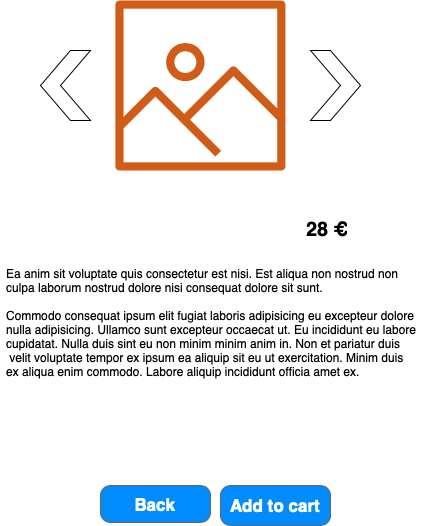
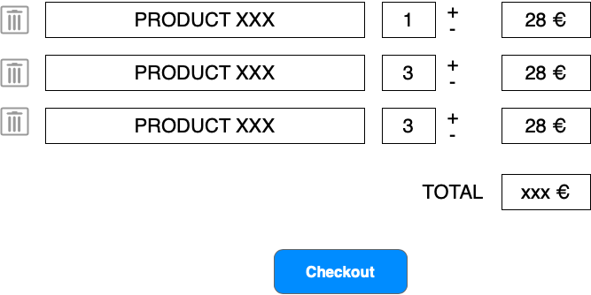
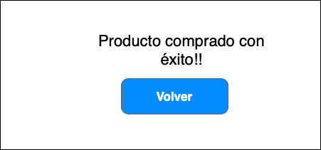

# eCommerce

El objetivo del proyecto es crear un pequeño comercio online.
Dicho comercio nos permitirá listar un conjunto de productos de la tienda, añadirlos a nuestro carrito y realizar la compra

## Funcionalidad

### Listado de productos
Pantalla principal de la aplicación.

Se mostrará un listado de productos, con su descripción breve y el precio. En la página también se muestra un mini-carrito con el resumen actual del pedido.

`EXTRA: implementar mecanismos de paginación`

### Añadir un producto al carrito

Al pulsar sobre el botón de añadir al carrito, la aplicación añadirá el producto al carrito (tanto en servidor como en cliente). Si ya existía (ya se había añadido, incrementará el número de unidades)

### Visualizar un producto

Al pulsar sobre "Ver", nos llevará a la página de detalle de un producto.

Dicha pantalla mostrará la descripción larga del producto así como las imágenes del mismo.

`EXTRA: Utilizar algún componente de carrusel, como https://bootstrap-vue.org/docs/components/carousel`

### Visualizar el carrito

Al pulsar sobre Checkout del minicarrito, nos llevará a la página de resumen del pedido.

En dicha pantalla, podremos realizar las siguientes acciones:

* Eliminar todo un producto
* Modificar las cantidades de un producto
* Finalizar el pago

### Finalizar el pago

Al pulsar sobre checkout, realizaremos la petición al servidor de generar un nuevo pedido y, redirigiremos a la página de finalizado.

## Requisitos técnicos

Aplicación web formada por el front-end con la capa de presentación y el back-end con la capa de procesado de datos.

Para faciliar el desarrollo, se encuentra disponible también una capa API de pruebas con datos mock (backend_modk)

La aplicación web será capaz de funcionar tanto con el API de pruebas como con la API real. (si es necesario generar lógica distinta para la invocación, está disponible la variable process.env.VUE_APP_API_IS_MOCK, que nos indica si está operando con datos reales o con mock)

* Utilización de vue 2 para el proyecto
* Utilización de vue-router para la navegación en las páginas
* Utilización correcta de componentes (listado, producto, carrito, item-carrito...)
* El frontend debe ser capaz de funcionar correctamente con el API de pruebas (mock)

## Bonus

* Realizar los puntos indicados como `EXTRA``
* Diseñar todo el UI mediante vue-bootstrap
* Implementar el carrito mediante Vuex